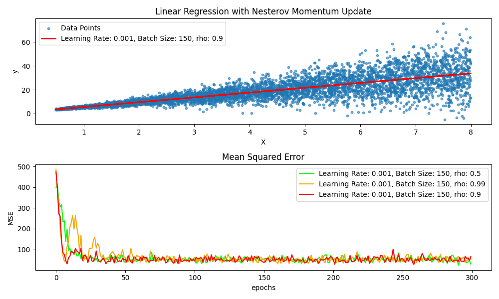

# Linear Regression Optimization Algorithms

This project implements various optimization algorithms used to train a linear regression model. Each optimizer adjusts the weights (parameters) of the model using different strategies to minimize the error (loss) function. The goal is to compare how different optimizers affect the convergence of the model in terms of accuracy and efficiency.

## Optimizers Overview

Optimization algorithms are essential in machine learning as they help in adjusting the parameters of a model to reduce the error. The most common optimizers include:

- **Gradient Descent (GD):** The simplest optimization algorithm that updates weights in the direction of the steepest negative gradient of the cost function.
- **Stochastic Gradient Descent (SGD):** A variant of GD that updates weights for each data point instead of using the entire dataset, often resulting in faster but noisier convergence.
- **Momentum:** Introduces a velocity-like term to accelerate the updates and smooth out fluctuations.
- **Nesterov Momentum:** A refined version of momentum that looks ahead by computing the gradient at the "look-ahead" position, improving convergence.
- **Adagrad:** Adapts the learning rate for each parameter based on its historical gradient, resulting in larger updates for infrequent parameters and smaller updates for frequent parameters.
- **RMSProp:** A variation of Adagrad that uses an exponentially decaying average of squared gradients to correct the aggressive, monotonically decreasing learning rates.
- **Adam:** Combines the benefits of momentum and RMSProp by computing adaptive learning rates for each parameter and considering both the first and second moments of the gradients.

## Optimizer Details

### 1. **Gradient Descent (GD)**
- **Description:** The algorithm updates the weights by moving in the opposite direction of the gradient of the loss function.
- **Formula:**

  $$w = w - \alpha \cdot \nabla L(w) $$

  where:
  - $\alpha$ is the learning rate,
  - $nabla L(w)$ is the gradient of the loss function with respect to the weights.

---

### 2. **Stochastic Gradient Descent (SGD)**
- **Description:** Unlike GD, SGD updates weights using a single data point (or mini-batch), leading to faster updates but more variance in the trajectory.
- **Formula:**

  $$w = w - \alpha \cdot \nabla L(w; x_i)$$

  where:
  - $\alpha$ is the learning rate,
  - $\nabla L(w; x_i)$ is the gradient with respect to a single data point $x_i$.

---

### 3. **Momentum**
- **Description:** Momentum adds a velocity term to the weight update, helping to accelerate the algorithm in the right direction and smooth out updates.
- **Formula:**

  $$v = \rho \cdot v + \alpha \cdot \nabla L(w)$$

  $$w = w - v$$

  where:
  - $\alpha$ is the learning rate,
  - $\rho$ is the momentum factor (usually between 0.5 and 0.9),
  - $v$ is the velocity term (previous weight update).

---

### 4. **Nesterov Momentum**
- **Description:** Nesterov momentum looks ahead by computing the gradient at the "look-ahead" position, often providing better convergence and more accurate updates.
- **Formula:**

  $$v = \rho \cdot v + \alpha \cdot \nabla L(w - \rho \cdot v)$$
  
  $$w = w - v$$

  where:
  - $\alpha$ is the learning rate,
  - $\rho$ is the momentum factor,
  - $v$ is the velocity term.

---

### 5. **Adagrad**
- **Description:** Adagrad adapts the learning rate for each parameter, allowing it to work better with sparse data and providing a larger learning rate for infrequent parameters.
- **Formula:**

  $$w = w - \frac{\alpha}{\sqrt{G_t + \epsilon}} \cdot \nabla L(w)$$

  where:
  - $\alpha$ is the learning rate,
  - $G_t$ is the sum of squared gradients up to time step $t$,
  - $\epsilon$ is a small constant for numerical stability.

---

### 6. **RMSProp**
- **Description:** RMSProp is similar to Adagrad but fixes the diminishing learning rates by using an exponentially decaying average of squared gradients.
- **Formula:**

  $$g = \rho \cdot g + (1 - \rho) \cdot (\nabla L(w))^2$$

  $$w = w - \frac{\alpha}{\sqrt{g + \epsilon}} \cdot \nabla L(w)$$

  where:
  - $\alpha$ is the learning rate,
  - $\rho$ is the decay rate (typically between 0.9 and 0.99),
  - $\epsilon$ is a small constant for numerical stability.

---

### 7. **Adam**
- **Description:** Adam combines the advantages of momentum and RMSProp, using both the first and second moments of the gradients (mean and uncentered variance).
- **Formula:**

  $$m_t = \beta_1 \cdot m_{t-1} + (1 - \beta_1) \cdot \nabla L(w)$$

  $$v_t = \beta_2 \cdot v_{t-1} + (1 - \beta_2) \cdot (\nabla L(w))^2$$

  $$m_{\hat{t}} = \frac{m_t}{1 - \beta_1^t}, \quad v_{\hat{t}} = \frac{v_t}{1 - \beta_2^t}$$

  $$w = w - \frac{\alpha}{\sqrt{v_{\hat{t}}} + \epsilon} \cdot m_{\hat{t}}$$

  where:
  - $\alpha$ is the learning rate,
  - $\beta_1$ and $\beta_2$ are the exponential decay rates for the moment estimates (typically \( \beta_1 = 0.9 \) and \( \beta_2 = 0.999 \)),
  - $\epsilon$ is a small constant for numerical stability.

---

## Conclusion

Each optimizer offers unique advantages depending on the problem, data, and the required trade-offs between speed and precision. You can experiment with different optimizers in this project to analyze their effects on model performance.
